# Autognosia

<p align="center">
  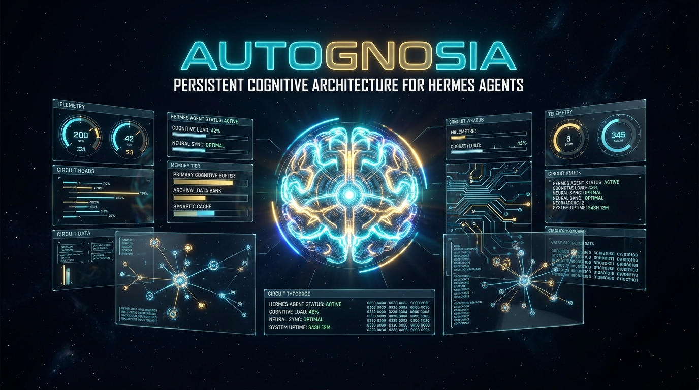
</p>

**A self-hosted cognitive architecture for persistent Hermes agents.**

Autognosia is an open architecture for turning [Hermes Agent](https://github.com/NousResearch/hermes-agent) into something more persistent than a chat session and more structured than "an LLM plus a vector database."

It combines:

* autobiographical memory;
* deterministic Personal Organizer (tasks, projects, subscriptions);
* interactive web dashboard & copilot (`http://127.0.0.1:8088`);
* multi-channel timed reminders (Telegram, Discord, Email, SMS, Desktop);
* current working knowledge;
* long-term knowledge;
* preserved evidence;
* prospective memory;
* procedural learning;
* planning;
* counterfactual reasoning;
* inhibitory control;
* epistemic discipline;
* verification;
* experience-based improvement;
* metacognitive routing;
* current external research.

The guiding principle is simple:

> **Knowledge changes temperature. It does not automatically disappear.**

Autognosia is designed to accumulate years of useful information while keeping the primary agent's limited attention focused on what matters now.

---

# Why "Autognosia"?

From Greek *auto-* (self) and *gnosis* (knowledge, recognition, knowing).

**Autognosia** literally means **self-knowledge**—the capacity of an intelligent system to monitor, evaluate, and govern its own cognitive state, memory, and competence.

Most persistent AI agents fail not because their underlying model lacks raw reasoning capability, but because the agent lacks **autognosis**:

* It doesn't know what it knows vs. what it merely inferred or hallucinated.
* It doesn't know what it has already learned in the past vs. what it needs to discover today.
* It doesn't know which tools, workflows, or specialist strategies actually succeed in reality.
* It doesn't know when to inhibit an action until critical preconditions are grounded.
* It doesn't know how to manage its own memory temperature without overloading working attention.

Autognosia provides Hermes Agent with that structured self-knowledge layer:

* **Epistemic Self-Knowledge:** Distinguishing hard evidence from inferences, tracking provenance, and holding execution when facts are stale or disputed.
* **Competence Self-Knowledge:** Logging real-world execution traces to learn empirically which routing pathways succeed more often.
* **Temporal Self-Knowledge:** Managing hot working memory, cold curated vaults, and prospective intentions that surface only when relevant cues occur.
* **Procedural Self-Knowledge:** Turning verified task successes into reusable, governed procedural skills.

Autognosia is the **metacognitive and persistent self-knowledge architecture around Hermes**.

Not an open-ended memory dump, but an agent that understands its own state.

---

# The Problem With "Memory"

Persistent agents need to answer very different questions across distinct temporal horizons and certainty levels:

<p align="center">
  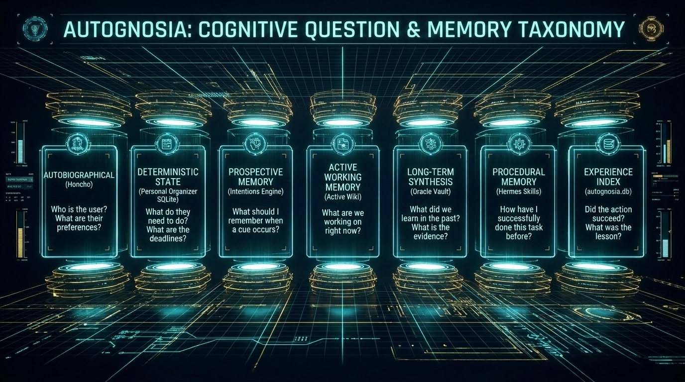
</p>

Those are not one database problem.

Autognosia gives each class of cognitive question a dedicated, authoritative home.

---

# Architecture

<p align="center">
  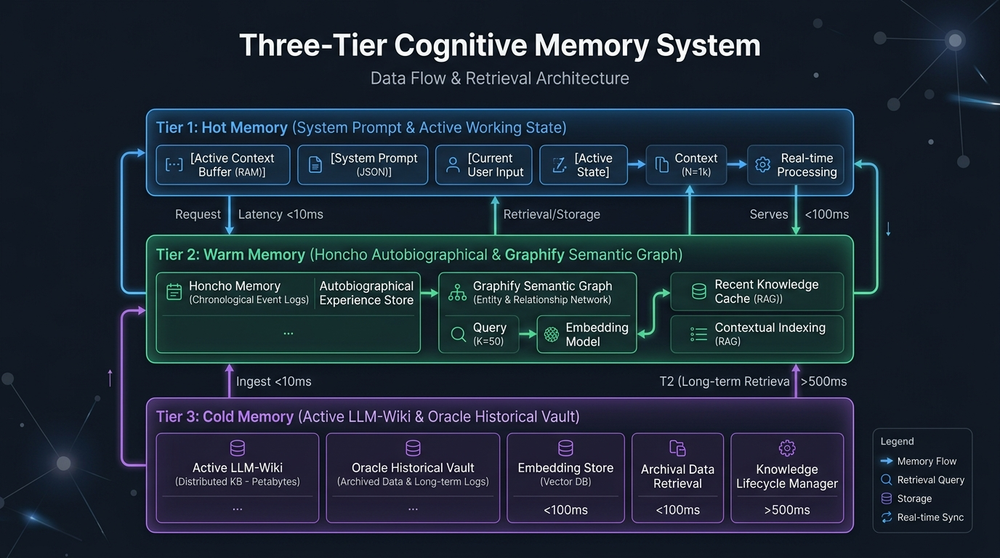
</p>

<p align="center">
  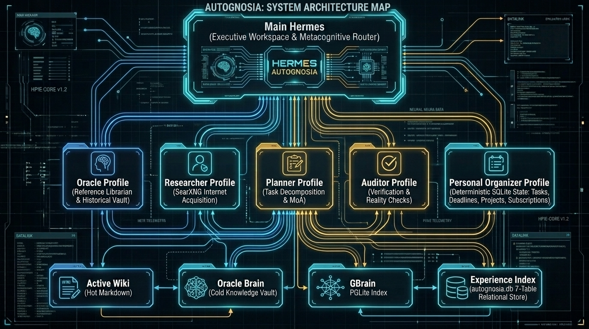
</p>

**Key architectural principles:**

1. **Main Hermes NEVER searches the internet directly.** ALL web research is delegated to the Researcher profile via `delegate_task()`. This is an absolute prohibition.
2. **Warm memory has two domains:** Honcho (autobiographical — who is this user?) and Graphify (knowledge relationships — how does my knowledge connect?).
3. **Cold memory** is the Markdown wiki (Active Wiki for current knowledge, Oracle Wiki for long-term knowledge).
4. **GBrain** is the historical index layer over the Oracle Wiki (optional, deployed separately).
5. **SearXNG** is the private search engine that the Researcher profile uses for web queries.

---

# Graphify: The Connective Layer

Autognosia adds **Graphify** as a derived relationship/navigation index over the existing knowledge system. Graphify is **NOT another canonical memory store**.

## What Graphify Is

- A **derived relationship/connectivity index** built on top of the Markdown wikis
- Useful primarily for **relationship and multi-hop retrieval** ("What connects X to Y?", "What concepts surround this topic?", "How does this connect to things I've researched before?")
- **Disposable and rebuildable** — if Graphify is deleted, corrupted, stale, or unavailable, ALL underlying knowledge remains intact
- **Two logically separate graphs**: Main Graph (from Active Wiki) and Oracle Graph (from Oracle Wiki) — never merged

## What Graphify Is NOT

- A replacement for the Main Wiki, Oracle Wiki, or Obsidian
- A source of truth or canonical knowledge store
- Another memory database (Honcho, GBrain, Personal Organizer remain authoritative for their domains)
- A mandatory gate for all retrieval — Hermes decides when graph traversal is useful
- A distillation process whose output becomes the only surviving copy

## Graphify's Role in Retrieval

<p align="center">
  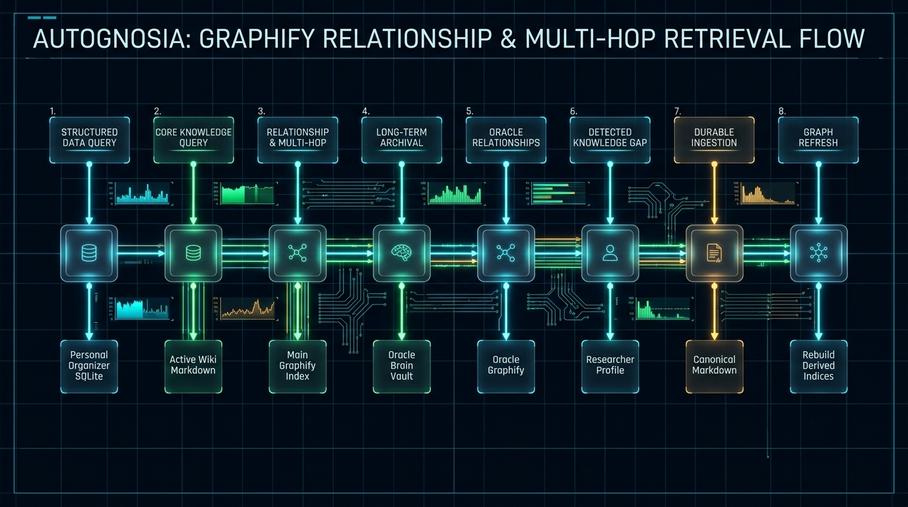
</p>

## Why Two Separate Graphs?

Main and Oracle are deliberately separate so Graphify does not accidentally bypass the intended hot/current vs long-term knowledge hierarchy. The Main Graph represents active/current knowledge. The Oracle Graph represents long-term knowledge and relationships. They are never automatically merged.

## Failure and Fallback Behavior

If Graphify is unavailable, stale, returning no result, or returning incorrect results:

**Fallback order:**
1. Ordinary wiki search
2. Direct Markdown/source inspection
3. Oracle (if appropriate)
4. Research Hermes

**Critical:** A Graphify failure or empty result MUST NOT be interpreted as proof that information does not exist. Never say "the knowledge does not exist" solely because Graphify failed to find it.

---

# Core Design Principle

Storage is relatively cheap.

Attention is expensive.

So Autognosia does not primarily solve long-term growth by deleting old information.

It changes how far the information is from the primary model's working context.

<p align="center">
  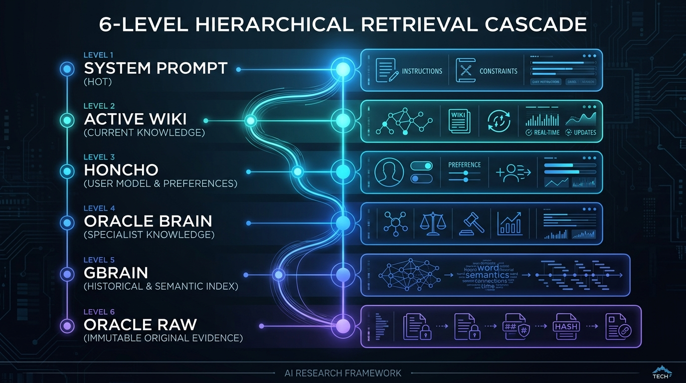
</p>

Cold does not mean forgotten.

It means:

> **retrieved only when relevant.**

---

# Cognitive Systems

## Main Hermes — Executive Workspace

Main Hermes communicates with the user.

Its primary job is not to know everything.

Its job is to determine:

```text
What kind of problem is this?

Where does authoritative information live?

Which cognitive mode is appropriate?

Do I have enough information?

Should I answer, retrieve, plan, research, ask, or abstain?
```

This keeps the main context lean.

---

# Honcho — Autobiographical Memory

[Honcho](https://github.com/plastic-labs/honcho) provides Autognosia's autobiographical/user-model layer.

It learns things such as:

* preferences;
* patterns;
* communication style;
* recurring goals;
* personal context.

```bash
# Clone upstream
git clone https://github.com/plastic-labs/honcho.git ~/honcho

# Copy Autognosia's universalized skills to your Hermes
cp -r deploy/honcho/skills/* ~/.hermes/skills/
```

The repo includes three universalized skills (personal details stripped):
- `honcho-deployment` — quick start and troubleshooting
- `honcho-docker-setup` — full Docker Compose setup, config fixes, verification
- `honcho-integration` — Hermes ↔ Honcho wiring (config.yaml, peers, sessions)

---

# NotebookLM (Optional)

[NotebookLM](https://notebooklm.google.com) is Google's AI-powered research tool. The Hermes integration comes from the [notebooklm-mcp-cli](https://github.com/nicholasgriffintn/notebooklm-mcp-cli) project.

```bash
pip install notebooklm-mcp-cli
nlm skill install hermes
```

Add to `~/.hermes/config.yaml`:
```yaml
mcp_servers:
  notebooklm:
    command: "notebooklm-mcp"
    args: []
    timeout: 180
```

Run `nlm login`, restart Hermes, and MCP tools appear as `mcp_notebooklm_*`.

---

# Personal Organizer — Deterministic Prospective State

Some things should not rely on probabilistic memory.

Personal Organizer is a small SQLite-backed service for:

* tasks;
* projects;
* subtasks;
* dependencies;
* deadlines;
* reminders;
* subscriptions;
* renewal dates;
* waiting states;
* important dates;
* project progress;
* activity history.

Examples:

```text
What's due today?

What am I waiting for?

Where did I leave off?

What's the next unblocked step?

When does this renew?

What did I finish last time?
```

These questions should have exact answers.

---

# Personal Organizer vs Hermes Kanban

The distinction is intentional.

<p align="center">
  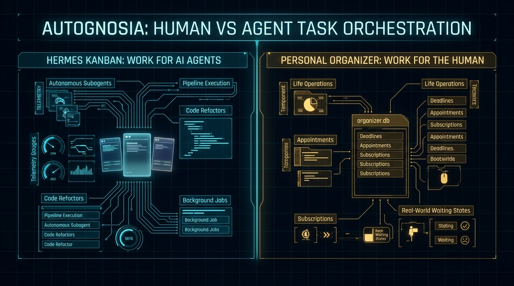
</p>

Both contain tasks.

They represent different kinds of actors and authority.

---

# Prospective Memory — Remembering Future Intentions

Humans need more than memories of the past.

They also need to remember:

> **what to do when something happens later.**

Autognosia therefore adds prospective intentions to Personal Organizer.

Examples:

```text
When this package arrives, remind me to install it.

When task A is finished, activate task B.

The next time we're talking about Mac Studio hardware,
remind me about the memory-bandwidth question.

If GBrain fixes this retrieval bug, let me know.

Three days before this renewal, remind me to cancel it.
```

Autognosia represents these as explicit:

<p align="center">
  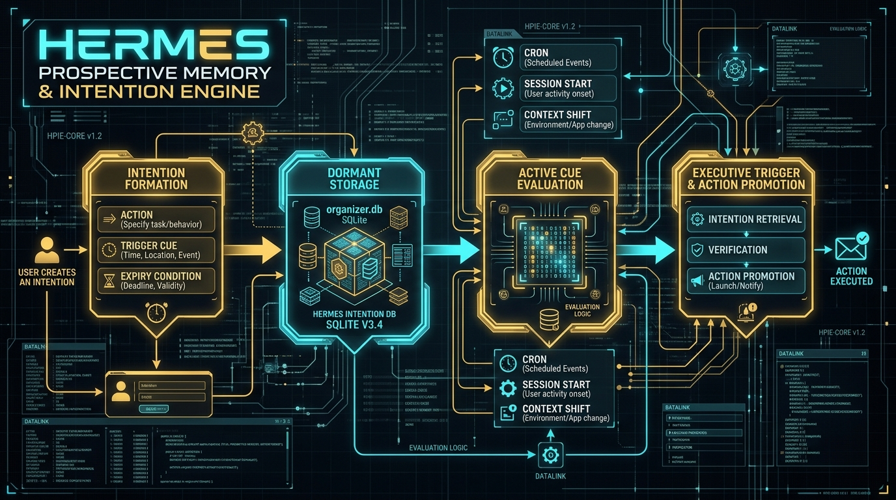
</p>

```text
IF cue X occurs
THEN surface/execute intention Y
```

---

# Prospective Memory Reuses Hermes Automation

Autognosia does not create another scheduling engine. It maps intentions onto existing execution primitives:

<p align="center">
  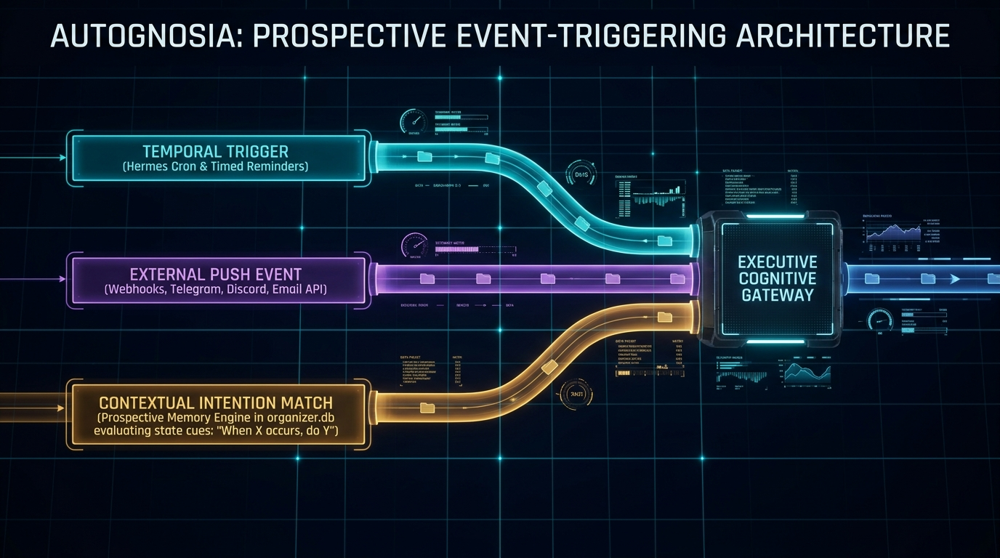
</p>

If an intention fires and becomes a long-running active objective:

Autognosia can turn it into a Hermes Persistent Goal.

---

# Active LLM-Wiki — Hot Knowledge

Current semantic knowledge lives in Hermes's bundled implementation of the LLM-Wiki pattern.

Examples:

* active projects;
* recent research;
* current technical decisions;
* current interests;
* recently supplied information;
* things likely to be needed soon.

There is intentionally no separate knowledge inbox.

The user intentionally provided the material.

It enters Active knowledge.

---

# LLM-Wiki

The pattern was introduced by Andrej Karpathy:

https://gist.github.com/karpathy/442a6bf555914893e9891c11519de94f

Hermes's bundled implementation:

https://hermes-agent.nousresearch.com/docs/user-guide/skills/bundled/research/research-llm-wiki

---

# Oracle — Long-Term Knowledge Librarian

Oracle is a dedicated Hermes Profile.

It searches a much larger historical corpus and returns a compact answer to Main Hermes.

<p align="center">
  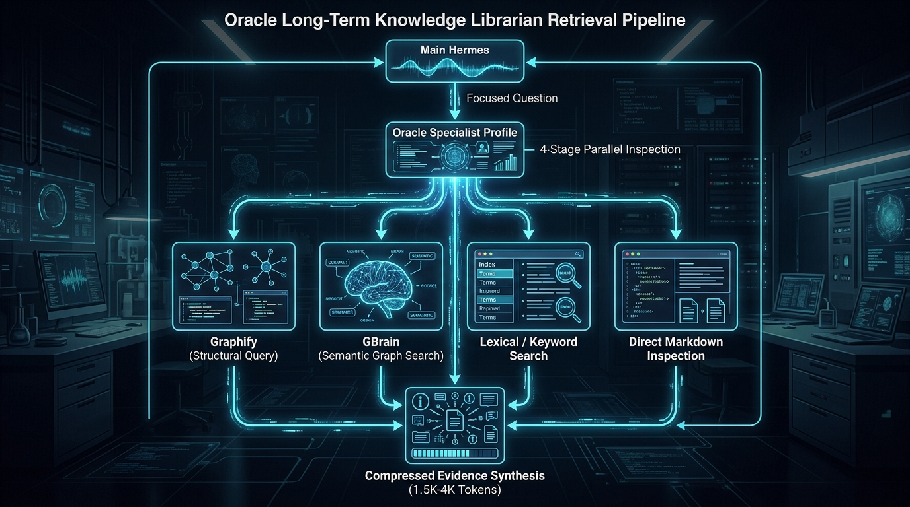
</p>

Oracle is a **context-compression boundary**.

It lets the long-term corpus grow without requiring the primary model to carry that corpus constantly.

---

# GBrain — Historical Retrieval Infrastructure

[GBrain](https://github.com/garrytan/gbrain), created by Garry Tan, provides Autognosia's scalable historical retrieval layer.

It contributes:

* semantic/vector search;
* lexical/full-text search;
* hybrid ranking;
* embedded vector and semantic search (PGLite);
* graph relationships;
* entity retrieval;
* provenance;
* MCP access.

**Deployment: Local Embedded PGLite (zero external database or Docker needed).**

Quick start:
```bash
bun install -g gbrain          # Install the CLI
gbrain init --pglite           # Initialize embedded database
gbrain doctor                  # Verify health
```

Project:

https://github.com/garrytan/gbrain

Architecture:

https://github.com/garrytan/gbrain/blob/master/docs/ENGINES.md

MCP deployment:

https://github.com/garrytan/gbrain/blob/master/docs/mcp/DEPLOY.md

Hermes Agent integration (including the Bun/PATH pitfall that breaks stdio
launch):

[`docs/GBRAIN-MCP.md`](docs/GBRAIN-MCP.md)

---

# GBrain Is an Index, Not the Sole Brain

Autognosia deliberately treats the GBrain database as **rebuildable infrastructure**.

<p align="center">
  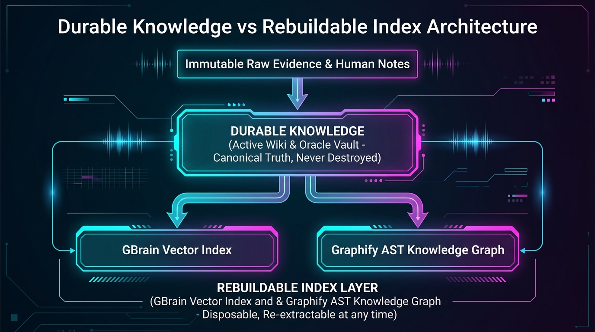
</p>

If the GBrain database breaks, it can be rebuilt from the canonical Markdown corpus. The underlying knowledge remains intact.

---

# Why Autognosia Disables GBrain Dream

The standard full-agent GBrain architecture includes a nightly dream cycle and extensive autonomous brain maintenance.

Autognosia does **not** enable that mode by default.

This is deliberate.

Autognosia distinguishes:

## Derived, rebuildable information

* embeddings;
* chunks;
* indexes;
* graph relationships;
* caches;
* additive metadata.

These can be regenerated.

## Hard-earned knowledge

* raw research;
* user-provided information;
* source material;
* historical conclusions;
* detailed evidence;
* intentionally retained knowledge.

Autognosia does not grant an autonomous retention process the authority to decide that the second category should cease to exist.

---

# Additive Synthesis

Autognosia is not opposed to summarization.

It is opposed to **destructive summarization**.

This is good:

<p align="center">
  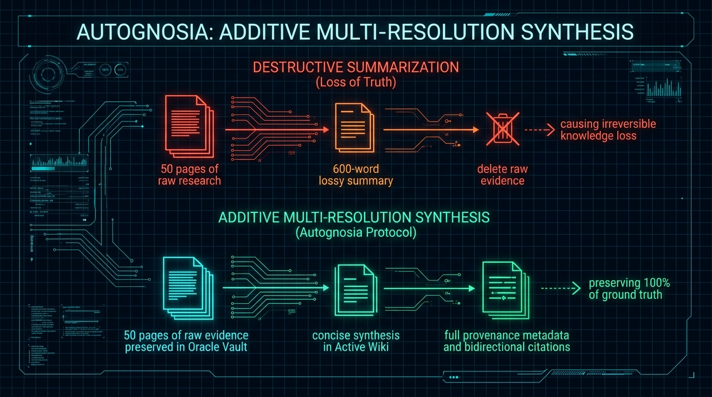
</p>

Future models may reinterpret old evidence better. The raw evidence should always remain preserved.

---

# Epistemic Control — Evidence Is Not Belief

<p align="center">
  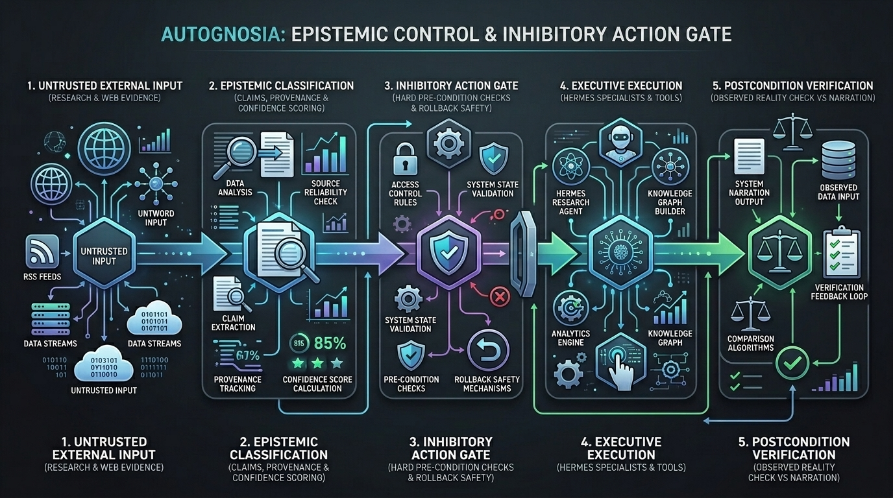
</p>

One of Autognosia's most important additions is an explicit epistemic layer.

Consider:

```text
Source A says 128K context.

Source B says 256K context.
```

A naive memory system may retrieve whichever chunk happens to rank first and present it as truth.

Autognosia instead represents:

```text
CLAIM:
maximum context = ?

STATUS:
DISPUTED

SUPPORT:
Source A → 128K
Source B → 256K
```

Research or Auditor can resolve it.

---

# Provenance Classes & Belief Revision

<p align="center">
  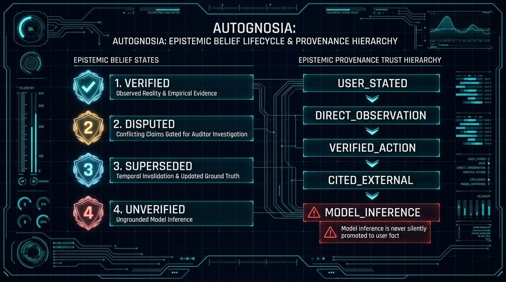
</p>

This prevents the most dangerous long-term-memory failure mode: an unverified model inference silently getting stored, retrieved months later, and hallucinated as *"you explicitly told me..."*. Knowledge evolves without erasing historical ground truth: outdated facts transition to `SUPERSEDED` while current discoveries become `VERIFIED`.

---

# Research Hermes — Knowledge Acquisition

Research is another Hermes Profile.

It is invoked when stored knowledge is:

* absent;
* incomplete;
* stale;
* explicitly required to be current.

Flow:

<p align="center">
  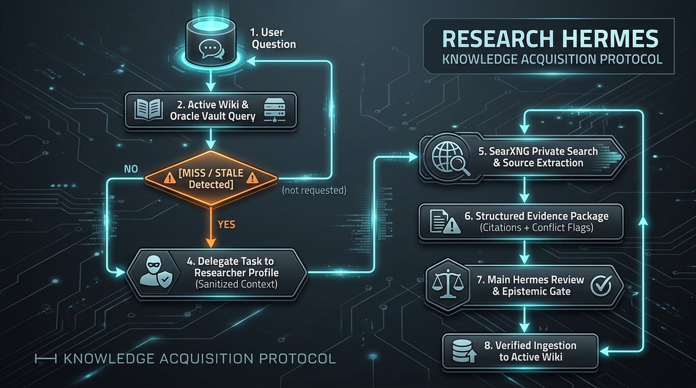
</p>

Research doesn't disappear after answering the user.

Meaningful findings become reusable knowledge.

---

# Research Preserves What Changed

If old knowledge already exists, Research should receive it.

Instead of asking:

> "Research this from zero."

Autognosia can ask:

> **"What changed since our previous conclusion?"**

That preserves the historical arc of knowledge.

---

# Planner — Executive Planning

Some requests should not go straight from language to action.

Planner is an isolated Hermes Profile for difficult or consequential tasks.

It evaluates state transitions and simulates consequences before execution:

<p align="center">
  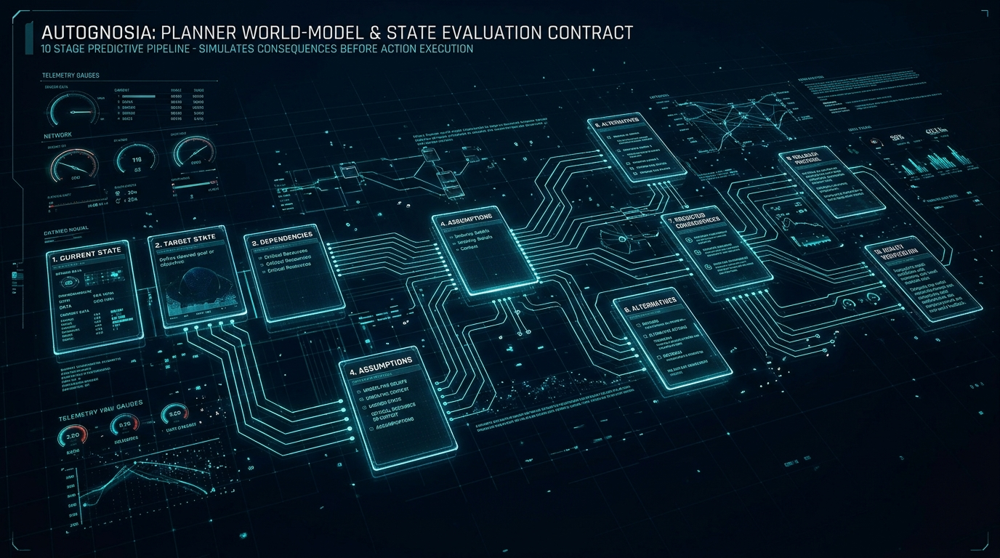
</p>

This is Autognosia's practical world-model layer. It predicts consequences ahead of time; the Verifier later observes reality.

It predicts.

The Verifier later observes reality.

---

# Pre-Mortem Reasoning

For high-risk work, Planner uses prospective hindsight:

> **Assume this plan failed badly. What probably caused the failure?**

That encourages discovery of:

* hidden dependencies;
* irreversible steps;
* bad assumptions;
* weak rollback paths;
* unverified prerequisites.

Then Planner revises the plan before execution.

This is reserved for consequential work.

Not grocery-list queries.

---

# Mixture of Agents Where It Actually Helps

When several appropriate models are already configured, Planner or Auditor may use Hermes's native Mixture of Agents.

Multiple perspectives can be useful for:

* architecture;
* difficult planning;
* conflict analysis;
* high-consequence review.

Autognosia does not turn every question into a committee meeting.

---

# Inhibitory Control — The Action Gate

Verification after an action is not enough.

Sometimes the right behavior is:

> **Don't act yet.**

The Autognosia Action Gate operates before consequential operations:

<p align="center">
  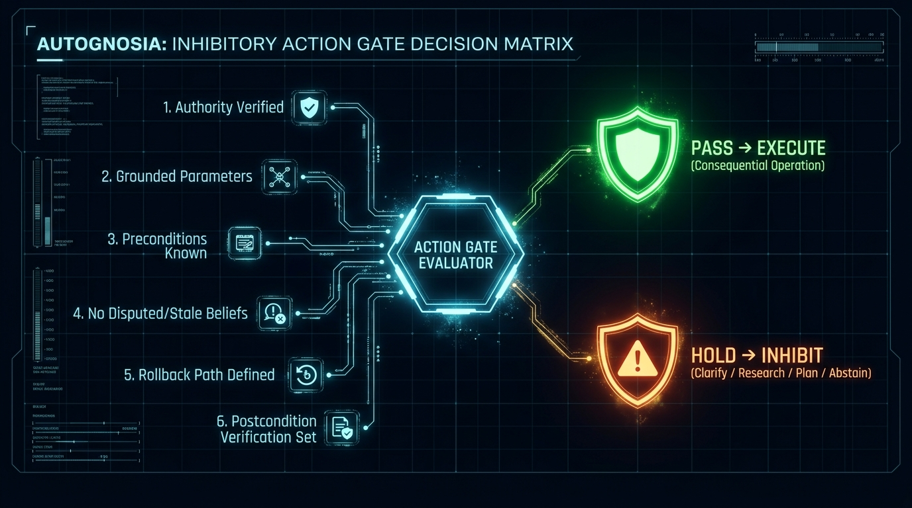
</p>

---

# The Action Gate Extends Hermes Security

Hermes already has dangerous-command approval.

Autognosia does not replace it.

Instead it adds cognitive/state constraints such as:

```text
do not delete canonical knowledge

do not delete Active content before archive verifies

do not destroy the database before backup verifies

do not execute a migration while a required compatibility
precondition is explicitly unresolved
```

Human authorization and cognitive readiness are different questions.

Both matter.

---

# Value of Information

A good agent also needs to know when a missing detail is worth asking about.

Without this, assistants tend toward one of two bad extremes:

```text
ask endless clarification questions
```

or:

```text
make consequential assumptions
```

Autognosia considers:

```text
Would this information materially change the decision?

What happens if the assumption is wrong?

Can Research discover it instead?

Is there a safe reversible default?
```

<p align="center">
  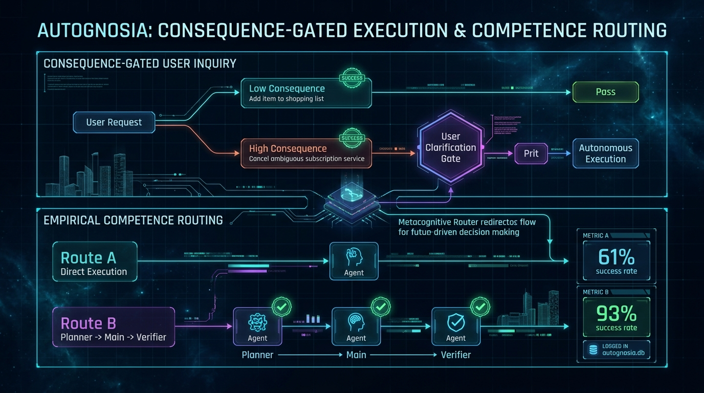
</p>

Future tasks of the same class preferentially use the empirically verified route logged in `autognosia.db`. That is practical metacognition: not subjective model confidence, but **"this routing topology has empirically succeeded more often."**

---

# Reasoning-Mode Selection

The Router dynamically selects the optimal execution mode and specialist delegation topology based on task complexity:

<p align="center">
  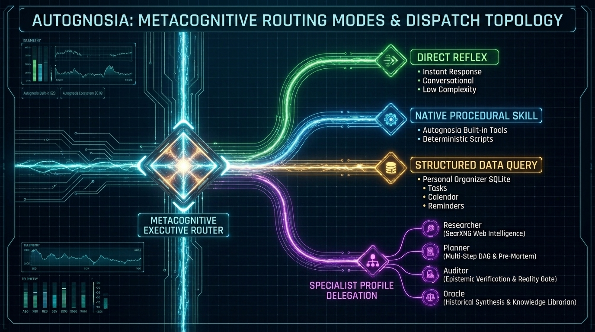
</p>

A simple task stays lightweight. A high-consequence task allocates deeper local compute and specialist delegation.

---

# Knowing When to Stop Thinking

Autognosia does not equate more tokens with better reasoning.

Oracle, Research and Planner ask:

```text
Do I have enough evidence now?

If not:
what specific evidence is missing?

Can another step plausibly obtain it?

If not:
stop and report uncertainty.
```

This is a satisficing architecture.

Thinking continues while the expected value of another step remains meaningful.

---

# Verification — Reality Gets the Final Vote

The Verifier is primarily a process rather than another agent.

<p align="center">
  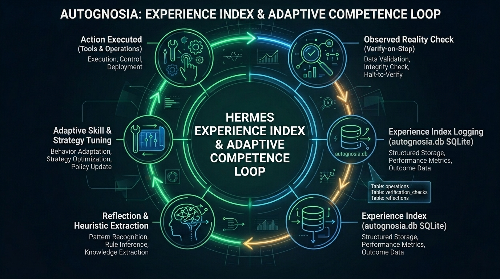
</p>

---

# Auditor — Judgment Only When Reality Has No Simple Test

Auditor is another isolated Hermes Profile.

It is used when deterministic verification isn't enough.

Examples:

* conflicting sources;
* semantic correctness;
* source-support review;
* plan quality;
* proposed procedural lesson.

The verification order is strictly layered:

<p align="center">
  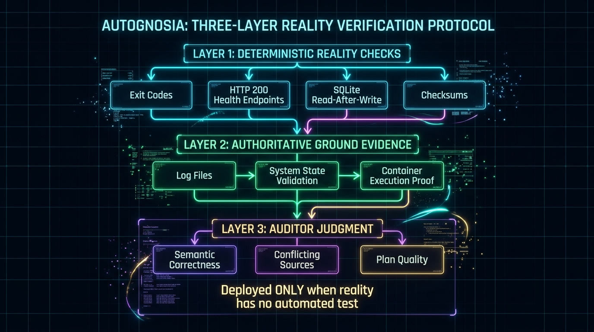
</p>

---

# Experience Index — Learning From Reality

Hermes already stores the raw execution transcripts.

Autognosia records structured operational traces and cognitive outcomes in `autognosia.db` across 7 dedicated tables:

* **`operations`**: Action-level execution traces (`session_id`, `profile`, `action`, `target`, `result`, `duration_ms`, `tokens_used`, `error_message`, `metadata`).
* **`verification_checks`**: Intended state vs. observed reality checks (`expected`, `observed`, `matched`, `verification_type`).
* **`routing_events`**: Profile dispatch decisions (`task_type`, `assigned_profile`, `reasoning_effort`).
* **`skill_events`**: Procedural skill executions and outcomes (`skill_name`, `version`, `outcome`).
* **`reflections`**: Evidence-gated lessons, warnings, and pattern recognitions (`category`, `trigger_event`, `lesson`, `proposed_action`).
* **`key_decisions`**: Critical architecture and strategic decisions with rationale and alternatives (`decision_context`, `rationale`).
* **`prospective_log`**: Intention triggers and lifecycle executions (`cue`, `intended_action`, `executed_at`).

That produces a queryable, measurable history of agent competence.

---

# Reflection Is Evidence-Gated

Autognosia does not run a nightly agent that sits around thinking about itself.

Reflection happens because something meaningful happened:

* verified failure;
* verified difficult success;
* recovery from failure;
* user correction;
* skill failure;
* unexpected state.

Then Autognosia asks:

```text
What assumption failed?

What actually solved the problem?

Was verification inadequate?

Was this failure transient?

Is there a reusable procedure?

Should routing change?

Did a belief need revision?
```

---

# Procedural Learning — Native Hermes Skills

The result of repeated experience is not another memory database.

It is a normal Hermes Skill.

<p align="center">
  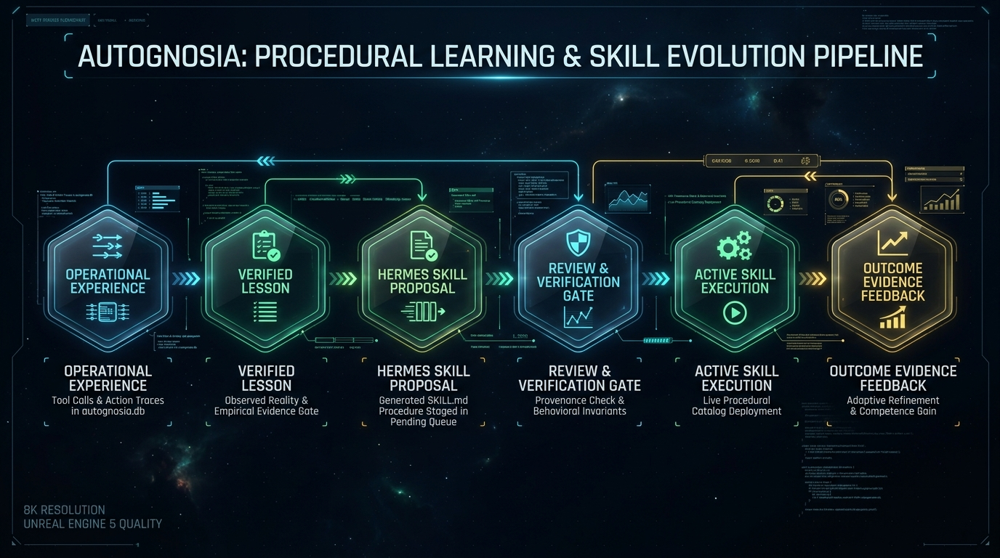
</p>

This is how the agent can become:

* faster;
* cheaper;
* more reliable;

at workflows it actually repeats.

---

# Skill Governance

A persistent bad procedure is worse than a one-time bad answer.

Autognosia therefore recommends staging native Hermes skill writes for review.

A proposed Skill should ideally carry provenance:

```text
Why does this Skill exist?

Which experiences motivated it?

Were those experiences verified?

What problem is this procedure supposed to prevent?
```

No second skill framework is required.

---

# Salience Without an Amygdala Agent

Autognosia does not simulate emotion.

It uses simple metadata:

```text
user importance
active-project relevance
unresolved
conflict
novelty
risk
```

This helps decide what deserves attention.

Low salience does **not** mean deletion.

---

# Prospective Retrieval Indexing

A long-term knowledge problem is not only:

> Can I store this?

It is also:

> **Will future-me phrase the question the same way?**

Autognosia can therefore generate a small number of alternate future retrieval cues for important knowledge.

Example:

Original fact:

```text
V100 fan bracket used a particular mounting configuration.
```

Possible retrieval cues:

```text
V100 cooling hardware

fan bracket mounting

rebuilding the V100 system

parts needed to reinstall the cooler
```

These are retrieval handles.

Not additional factual claims.

---

# Hot-to-Cold Knowledge & Lossless Archiving

Knowledge moves through structured temperature tiers according to relevance, ensuring permanent retention without attention bloat:

<p align="center">
  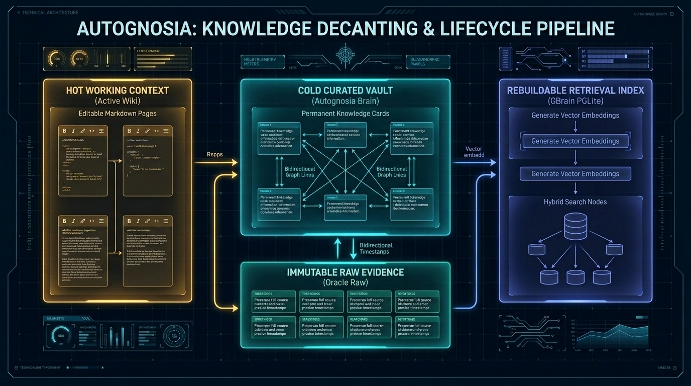
</p>

This is a change in retrieval cost—never a deletion lifecycle. Active knowledge is only decanted to the cold curated Oracle vault after full raw evidence preservation, checksum verification, and search indexing succeed. If any verification step fails, active knowledge remains untouched.

---

# Reactivation

Historical information can become active again.

Autognosia does not pull history out of Oracle and erase the archival version.

<p align="center">
  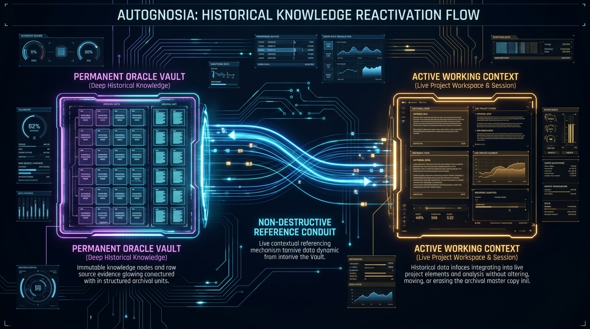
</p>

Historical knowledge remains permanently grounded and immutable in the Oracle Vault while being seamlessly referenced and surfaced within active working pages without mutating the archival record.

---

# Failure Tolerance

Autognosia assumes every component can fail.

## GBrain search misses something

Use literal Markdown search.

## GBrain database breaks

Rebuild it from canonical knowledge.

## Oracle synthesis seems wrong

Read the cited source.

## Research is stale

Research again.

## Sources disagree

Mark the belief disputed.

## Planner predicts incorrectly

Verifier records reality.

## Agent says "done"

Verifier checks.

## Skill fails

Record outcome and revise using native Hermes learning.

## Reflection is bad

Reject/supersede it.

The underlying experience remains.

---

# Why Not One Giant Vector Database?

Because:

```text
What's due today?
```

is not the same problem as:

```text
What do I prefer?
```

which isn't the same as:

```text
What did we conclude?
```

which isn't the same as:

```text
What exactly happened?
```

which isn't the same as:

```text
Should I execute this command?
```

Vector retrieval can participate in cognition.

It should not become the authority for every type of state.

---

# Why Not Just Use a Massive Context Window?

Because capacity is not attention.

A model can technically fit a large corpus and still perform worse when the useful evidence is buried in irrelevant material.

<p align="center">
  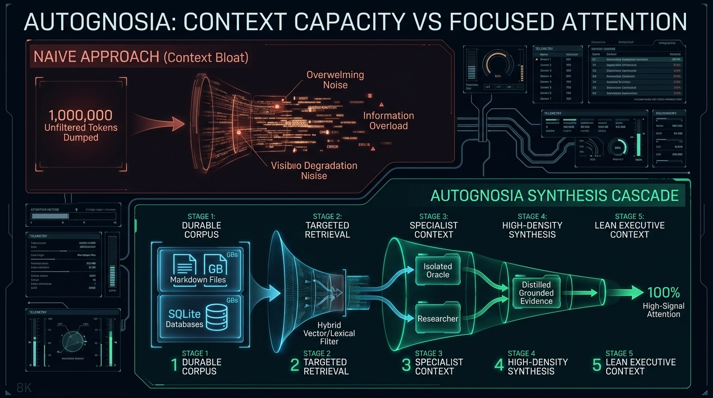
</p>

Autognosia therefore prioritizes targeted precision retrieval, specialist context isolation, and high-density distillation over naive context bloat.

---

# Docker Architecture

Typical deployment:

<p align="center">
  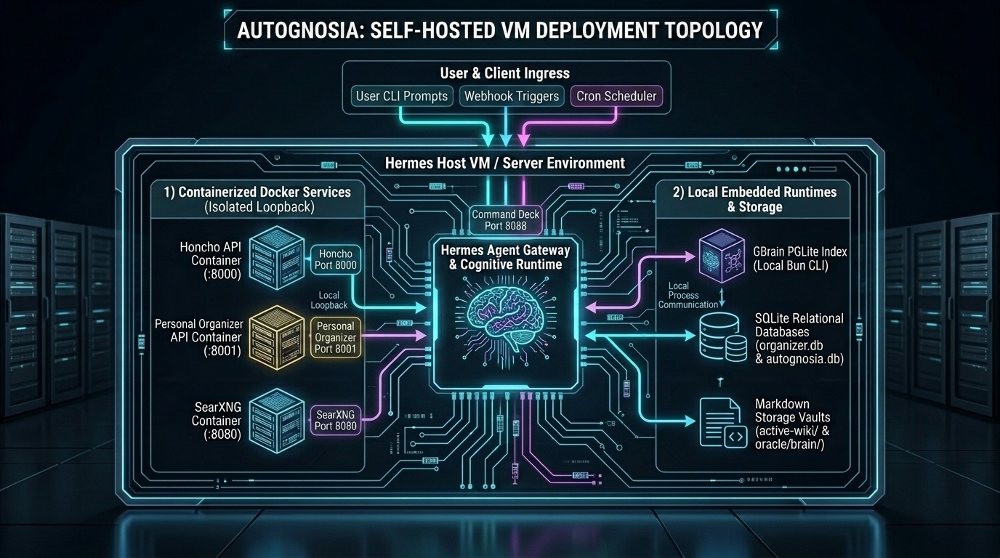
</p>

Services used only by Hermes can remain loopback-only.

Databases remain isolated.

---

# Autognosia Command Deck (Executive Dashboard)

The **Command Deck** is a lightweight local executive web interface running on **Port 8088** (`http://127.0.0.1:8088`). It unifies personal operations, schedule management, communications triage, second brain retrieval, and conversational control into a single real-time dashboard.

### Core Features

* **Multi-View Calendar (Day / Week / Month):** Aggregates task deadlines, subscription renewals (`organizer.db`), and external Google Calendar / `.ics` feeds.
* **Personal Organizer Pipeline:** Live CRUD task management with priority filters (`critical`, `high`, `medium`, `low`) and active project completion rings.
* **Multi-Channel Reminders:**
  - Create timed or relative alerts (*"Remind me in 15 minutes to check logs"*, *"Remind me on Friday at 3 PM to call Sarah"*).
  - Manage in-dashboard with quick snooze (`+5m`, `+15m`, `+1h`) and dismiss actions.
  - Automatically dispatches alerts to your configured channel: **Telegram Bot**, **Discord Webhook**, **Email (SMTP)**, **Phone/SMS (Twilio)**, or **Local Desktop**.
  - Indexed SQLite query with $<0.01\%\text{ CPU}$ and $<5\text{MB}$ RAM overhead.
* **Email Action Radar:** Prioritizes incoming communications and highlights extracted commitments.
* **Prospective Intentions Stream:** Monitors triggerable `IF cue THEN action` rules from `organizer.db`.
* **Second Brain Search:** Sub-millisecond instant search across `Active Wiki` and `Oracle Vault` markdown pages with built-in document reader.
* **In-Dashboard Copilot Chat:** Direct slide-over chat drawer to talk to Hermes, execute tasks, or search knowledge without leaving the browser.
* **Cognitive Telemetry:** Live health status of all Autognosia memory tiers, Docker containers, and profiles.

### Access & Service Ports

| Service | Port | Endpoint | Description |
| :--- | :--- | :--- | :--- |
| **Command Deck UI** | `8088` | `http://127.0.0.1:8088` | Executive Web Dashboard & Copilot Chat |
| **Command Deck API** | `8088` | `http://127.0.0.1:8088/docs` | Interactive OpenAPI REST Endpoints |
| **Personal Organizer** | `8001` | `http://127.0.0.1:8001/docs` | State & Task REST API |
| **SearXNG** | `8080` | `http://127.0.0.1:8080` | Local Metasearch Engine |
| **Honcho Memory** | `8000` | `http://127.0.0.1:8000` | Autobiographical User Model API |

The Command Deck automatically starts as a background service during repository setup (`auto_setup.sh` or through the standard setup prompt). To launch manually at any time:
```bash
python3 scripts/run_dashboard.py
```

---

# Sources of Truth

| Information                        | Authority                                         |
| ---------------------------------- | ------------------------------------------------- |
| User-model / inferred preferences  | Honcho                                            |
| Human tasks/projects/subscriptions | Personal Organizer (`organizer.db -> tasks`)      |
| Timed multi-channel reminders      | Personal Organizer (`organizer.db -> reminders`)  |
| Future cue-based intentions        | Personal Organizer (`organizer.db -> intentions`) |
| Current semantic knowledge         | Active LLM-Wiki                                   |
| Historical synthesized knowledge   | Oracle Brain                                      |
| Raw historical/research evidence   | Oracle Raw                                        |
| Long-term retrieval/indexing       | GBrain                                            |
| Exact conversation/tool history    | Hermes SessionDB                                  |
| Reusable procedures                | Hermes Skills                                     |
| Execution outcome metadata         | Autognosia Experience Index                           |
| Epistemic state                    | GBrain provenance/facts + Autognosia control metadata |
| Fresh external evidence            | Research Hermes                                   |
| Complex planning                   | Planner                                           |
| Ambiguous evaluation               | Auditor                                           |

---

# What Autognosia Explicitly Does Not Build

## No custom Skill Foundry

Hermes already has procedural memory.

## No second transcript store

Hermes already has SessionDB.

## No second generic multi-agent framework

Hermes already has Profiles, Delegation, Kanban and MoA.

## No second coding verifier

Hermes already has verify-on-stop.

## No separate scheduler

Hermes already has cron and webhooks.

## No Amygdala Agent

Salience metadata is sufficient.

## No emotion simulator

No demonstrated need for this architecture.

## No perpetual consciousness/global-workspace loop

Main Hermes already serves as a controlled executive workspace.

## No free-running Curiosity Agent

Research serves user goals and detected knowledge gaps.

## No autonomous Dreamer

Autognosia does not need an LLM wandering through private knowledge overnight.

## No automatic forgetting

Retrieval temperature solves the scaling problem without requiring destructive retention decisions.

---

# Classical Cognitive Architecture Influence

Long before LLM agents, cognitive architectures such as ACT-R and Soar separated concepts including:

* working state;
* semantic memory;
* episodic memory;
* procedural knowledge;
* goal-directed action.

Autognosia follows the same broad engineering lesson:

> **Different kinds of cognitive state deserve different semantics.**

It does not embed ACT-R or Soar.

---

# Installation

See:

[`INSTALL.md`](./INSTALL.md)

The installation file is written to be given directly to Hermes Agent.

Hermes should inspect the target machine, preserve existing components, install what is missing, configure the Autognosia architecture and run its complete acceptance suite.

---

# Documentation

| File | Purpose |
|------|---------|
| [INSTALL.md](INSTALL.md) | Quick start deployment |
| [SETUP.md](SETUP.md) | Detailed configuration (profiles, cron, wiki, schema) |
| [REFERENCE.md](REFERENCE.md) | Architecture deep-dive, epistemic protocol, security |
| [SYSTEM-RULES.md](SYSTEM-RULES.md) | Rules for all profiles |
| [ATTRIBUTION.md](ATTRIBUTION.md) | Credits for external projects and skills |
| [TROUBLESHOOTING.md](TROUBLESHOOTING.md) | Common issues and fixes |
| [REQUIRED_INPUTS.md](REQUIRED_INPUTS.md) | Configuration values needed during setup |
| [IMPROVEMENTS.md](IMPROVEMENTS.md) | Proposed improvements (memory dedup, metadata, etc.) |
| [AUDIT.md](AUDIT.md) | Internet research audit of all components |
| [EXPLANATION.md](EXPLANATION.md) | Explanation of hermes-config-backup and related decisions |

---

# Licensing and Attribution

Autognosia is an independent integration/orchestration project.

Each upstream dependency retains its own copyright and license.

Consult the upstream repository for current terms before redistributing upstream source code.

The Autognosia repository's license does not supersede the license of any dependency.

---

# The Autognosia Test

Every proposed addition to the project should answer:

> **What concrete failure mode does this solve?**

and:

> **Why isn't an existing Hermes or Autognosia subsystem already solving it?**

If the answer is:

> "It already does,"

don't add another subsystem.

---

# The Short Version

A normal persistent agent tends to become:

```text
LLM
+
more prompts
+
bigger memory database
```

Autognosia instead aims for:

<p align="center">
  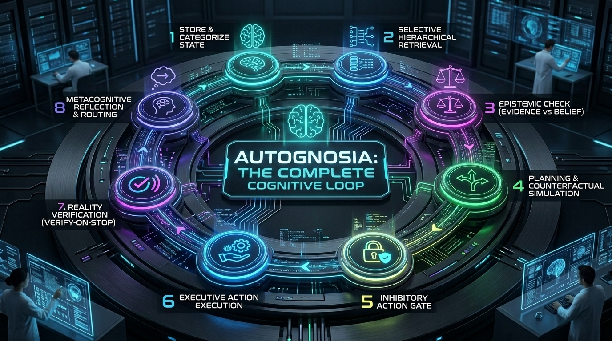
</p>

All while keeping the evidence that made the system smarter.

That is **Autognosia**.

---

# Licensing and Attribution

Autognosia is an independent integration/orchestration project.

Each upstream dependency retains its own copyright and license.

Consult the upstream repository for current terms before redistributing upstream source code.

The Autognosia repository's license does not supersede the license of any dependency.

---

# Independence

Autognosia is an independent project.

It is not endorsed by or affiliated with Nous Research, Plastic Labs, Garry Tan, Andrej Karpathy, or the maintainers of the other upstream projects unless explicitly stated otherwise.

---

# Upstream Projects

## Hermes Agent — Nous Research

https://github.com/NousResearch/hermes-agent

https://hermes-agent.nousresearch.com/docs/

## Honcho — Plastic Labs

https://github.com/plastic-labs/honcho

https://honcho.dev/

## GBrain — Garry Tan

https://github.com/garrytan/gbrain

## LLM-Wiki Pattern — Andrej Karpathy

https://gist.github.com/karpathy/442a6bf555914893e9891c11519de94f

## Graphify — Graphify-Labs / Safi Shamsi

https://github.com/safishamsi/graphify

## SQLite

https://sqlite.org/

## PGLite

https://pglite.dev/

## Docker

https://www.docker.com/

## FastAPI

https://fastapi.tiangolo.com/

## CamoFox — Browser Automation

https://github.com/jo-inc/camofox-browser

CamoFox provides headless Firefox automation for web scraping and browsing tasks.

## Firecrawl — Web Scraping & Crawling

https://github.com/mendableai/firecrawl

Firecrawl enables AI-grade web scraping with structured output, crawl chains, and browser automation.

## SearXNG — Private Metasearch

https://github.com/searxng/searxng

SearXNG is a free internet metasearch engine which aggregates results from various search services and databases.

## NUQ PostgreSQL — Firecrawl Queue Backend

https://github.com/mendableai/firecrawl/tree/main/apps/nuq-postgres

Custom PostgreSQL build required by Firecrawl v2+ for its internal job queue system.

## Playwright — Browser Automation

https://github.com/microsoft/playwright

Playwright enables reliable end-to-end testing for web apps and powers Firecrawl's browser automation layer.